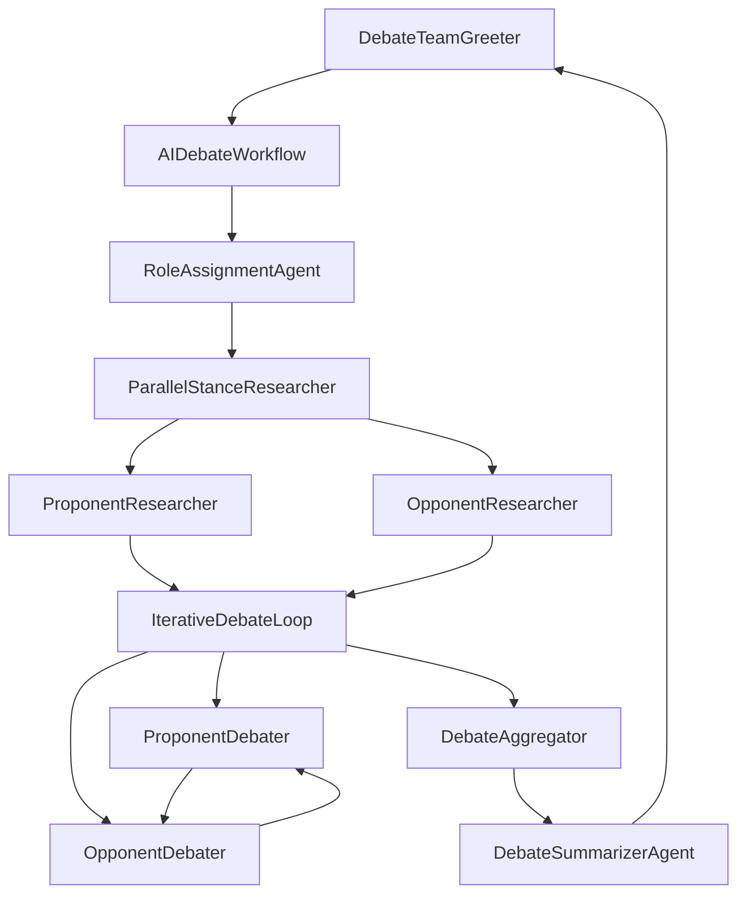

# AI Debate Team: ADK Agent Architecture Showcase 🤖⚖️

A **comprehensive demonstration of Google's Agent Development Kit (ADK)** capabilities through a sophisticated multi-agent debate system. This project showcases **all major ADK agent types** working together in a real-world application.

## 🎯 ADK Features Demonstrated

### 🏗️ **Agent Types Showcased:**

| ADK Agent Type | Implementation | Purpose |
|----------------|----------------|---------|
| **LlmAgent** | `DebateTeamGreeter`, `RoleAssignmentAgent`, `ProponentDebater`, etc. | Core conversational and reasoning agents |
| **SequentialAgent** | `AIDebateWorkflow` | Orchestrates step-by-step workflow execution |
| **ParallelAgent** | `ParallelStanceResearcher` | Concurrent research execution (Pro + Con) |
| **LoopAgent** | `IterativeDebateLoop` | Iterative debate rounds between agents |

### 🛠️ **ADK Capabilities Demonstrated:**

- ✅ **Multi-agent orchestration** - 7 specialized agents working together
- ✅ **Workflow patterns** - Sequential → Parallel → Iterative → Sequential
- ✅ **State management** - Data flow between agents via output keys
- ✅ **Tool integration** - Google Search API and custom function tools  
- ✅ **Agent transfers** - Dynamic control flow with `transfer_to_agent`
- ✅ **Escalation patterns** - Smart termination with `end_debate` tool
- ✅ **Session continuity** - Persistent conversation loops
- ✅ **Cloud deployment** - Production-ready Agent Engine deployment

## 🚀 Architecture Deep Dive

### **Complete Agent Pipeline:**



### **ADK Pattern Implementations:**

1. **Root Agent Pattern**: `DebateTeamGreeter` as conversation controller
2. **Workflow Orchestration**: `SequentialAgent` for step-by-step execution  
3. **Parallel Execution**: Simultaneous research on opposing positions
4. **Iterative Processing**: **Real debate rounds using `LoopAgent`**
5. **State Flow**: Output keys create data pipeline between agents
6. **Tool Integration**: Google Search + custom function tools
7. **Transfer Mechanisms**: Agent-to-agent control transfer
8. **Termination Logic**: Quality-based and iteration-based stopping

## 🎯 Key ADK Learning Outcomes

**For ADK Developers, this project demonstrates:**

- **Multi-agent system design** with clear separation of concerns
- **Workflow agent composition** (Sequential → Parallel → Loop)
- **State management** patterns for data flow
- **Tool integration** best practices
- **Production deployment** with Agent Engine
- **Real-world application** of ADK patterns

## 🔧 Technical Implementation

### **State Variables Flow:**
```python
debate_topic → role_assignments → research_findings → current_round → debate_rounds → final_summary
```

### **Agent Configuration Examples:**

```python
# LoopAgent for iterative rounds
iterative_debate_loop = LoopAgent(
    name="IterativeDebateLoop",
    sub_agents=[proponent_debater, opponent_debater],
    max_iterations=8
)

# ParallelAgent for concurrent research  
parallel_research = ParallelAgent(
    name="ParallelStanceResearcher",
    sub_agents=[proponent_researcher, opponent_researcher]
)

# SequentialAgent for workflow orchestration
debate_workflow = SequentialAgent(
    name="AIDebateWorkflow", 
    sub_agents=[roles, research, debate_loop, aggregator, summarizer]
)
```

## 🚀 Quick Start

### Prerequisites
- Python 3.9+
- Google Cloud Project with Vertex AI enabled
- Google Cloud SDK installed and authenticated

### Local Development

1. **Clone and setup**:
```bash
git clone <repository-url>
cd ADK_Multiagent
uv pip install -r requirements.txt
uv pip install -e .
```

2. **Configure environment** (`.env`):
```bash
GOOGLE_CLOUD_PROJECT=your-project-id
GOOGLE_CLOUD_LOCATION=us-central1
GOOGLE_CLOUD_STORAGE_BUCKET=your-bucket
GOOGLE_API_KEY=your-api-key
GOOGLE_GENAI_USE_VERTEXAI=1
```

3. **Run locally**:
```bash
adk web
```

4. **Test the agent types**:
```
User: Hello
→ DebateTeamGreeter (LlmAgent)

User: renewable energy vs fossil fuels  
→ AIDebateWorkflow (SequentialAgent)
  → RoleAssignmentAgent (LlmAgent)
  → ParallelStanceResearcher (ParallelAgent)
  → IterativeDebateLoop (LoopAgent) ← **Real iterative rounds!**
  → DebateAggregator (LlmAgent)
  → DebateSummarizerAgent (LlmAgent)
→ Back to DebateTeamGreeter
```

## ☁️ Cloud Deployment

### Deploy to Agent Engine:
```bash
python deployment/deploy.py --create
```

### Test cloud deployment:
```bash
python deployment/test_deployment.py --resource_id <RETURNED_ID> --user_id test_user
```

## 📁 Project Structure

```
ADK_Multiagent/
├── debate_team/           # Multi-agent system implementation
│   ├── __init__.py       
│   └── agent.py          # All ADK agent type demonstrations
├── deployment/           # Cloud deployment utilities
│   ├── deploy.py         # Agent Engine deployment
│   └── test_deployment.py # Cloud testing
├── pyproject.toml        # Package configuration
├── requirements.txt      # ADK and dependencies
└── .env                  # Environment configuration
```

## 🎓 Educational Value

**Perfect for learning:**
- ADK multi-agent patterns
- Workflow agent composition  
- State management in agent systems
- Tool integration best practices
- Production ADK deployments
- Real-world agent orchestration

## 🤝 Contributing

This project welcomes contributions that:
- Demonstrate additional ADK features
- Improve agent patterns and workflows
- Add new tool integrations
- Enhance deployment configurations

## 📝 License

MIT License - Built as an educational showcase of Google ADK capabilities

## 🙏 Acknowledgments

- **Google Agent Development Kit (ADK)** - Core framework
- **Vertex AI** - Cloud AI platform
- **Gemini Models** - LLM capabilities

---

**Ready to explore ADK's multi-agent capabilities through real debate scenarios?** 🚀

*This project demonstrates that ADK's agent types can be composed into sophisticated, production-ready applications.* 
